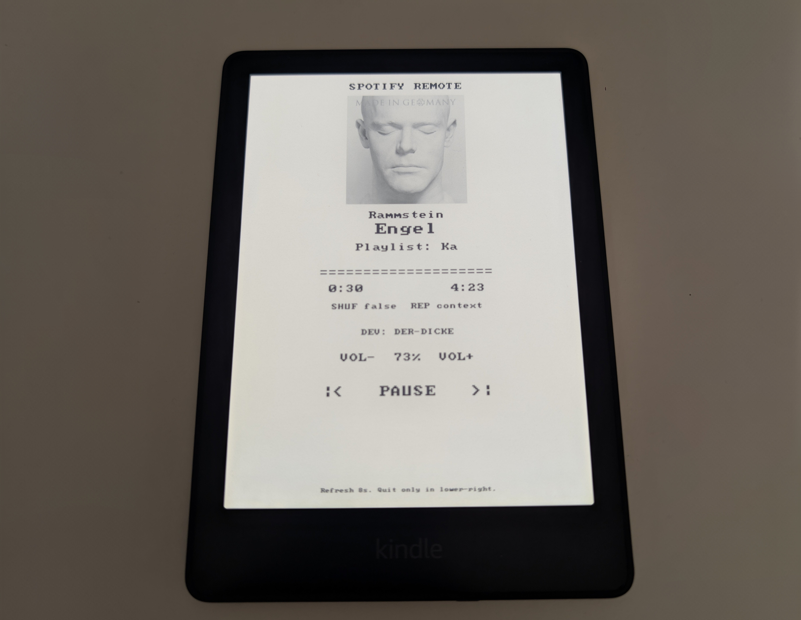

# Kindle Spotify Remote

Spotify playback control for jailbroken Kindle devices via KUAL.

This project provides a Kindle-friendly Spotify remote with a native e-ink touch UI, a passive now-playing display, and a fallback browser-based interface. It is designed around Kindle Paperwhite 11th generation / PW5 class devices, but the code is intentionally small enough to adapt to nearby Kindle models.

This is an independent hobby project and is not affiliated with, endorsed by, sponsored by, or approved by Spotify AB or Amazon.



## Features

- Native full-screen Kindle remote launched from KUAL
- Touch controls for play/pause, next, previous, centered volume +/- controls, shuffle, repeat, refresh, login, and device selection
- Passive now-playing display for e-ink dashboards
- Current Spotify playlist/playback context display when available
- Spotify OAuth PKCE flow without a client secret
- Local token refresh and Spotify Web API proxy
- Manual login fallback for Kindle browser redirect issues
- Cross-compile scripts for Linux ARM Kindle targets
- Recovery script to restart the Kindle framework if the native UI is interrupted

## Target Devices

The current native layout is tuned for Kindle Paperwhite 11th generation / PW5 style devices.

Current native assumptions:

- Display: `1236x1648`
- Touch raw range: `0..4095`
- Renderer: Kindle `eips`
- Extension path on device: `/mnt/us/extensions/spotify-remote`

Other Kindle models may need layout or touch-coordinate calibration in `extensions/spotify-remote/src/native/main.go`.

## Architecture Notes

Detailed implementation and research notes live in `docs/PROJECT_DOCUMENTATION.md`. That document is intentionally internal and avoids repeating this README's setup and user instructions.

## Development Assistance

Codex was used as the main coding agent for this project, including GPT-5.4 and GPT-5.5 based implementation passes. Gemini was used for external research on Kindle/KUAL development details.

## Repository Layout

```text
README.md                  Public project overview
docs/
  PROJECT_DOCUMENTATION.md Internal implementation and deployment notes
  crash-logs/              Historical crash logs kept for debugging context
scripts/
  deploy-kindle.ps1         Windows USB deploy helper
extensions/spotify-remote/
  config.xml                KUAL extension metadata
  menu.json                 KUAL menu definition
  launch.sh                 Starts the native touch remote through run-native.sh
  run-native.sh             Stops Kindle framework, runs native binary, restores framework
  stop.sh                   Stops the native app and restores Kindle UI
  recover.sh                Emergency UI recovery helper
  nowplaying-launch.sh      Starts passive now-playing display
  nowplaying.sh             Draws passive now-playing display with fbink/eips
  nowplaying-stop.sh        Stops passive now-playing display
  build.sh                  Linux/macOS cross-compile helper
  build.ps1                 Windows PowerShell cross-compile helper
  src/native/main.go        Native KUAL/touch/eips Spotify remote
  src/spotify-remote.go     Browser-server remote implementation
  www/                      Browser UI assets
```

The Kindle-side launcher prefers `bin/spotify-remote-arm.new` when present. This is useful for USB deployments where the currently running `spotify-remote-arm` may be locked by the Kindle.

## Requirements

Kindle:

- Jailbroken Kindle with KUAL
- Shell script execution from `/mnt/us/extensions`
- Network access to Spotify endpoints
- Spotify Premium for playback-control actions

Development machine:

- Go
- PowerShell on Windows or POSIX shell on Linux/macOS

Spotify:

- Spotify Developer app
- Redirect URI configured as `http://127.0.0.1:8787/callback`

## Spotify Setup

1. Open the Spotify Developer Dashboard.
2. Create an app.
3. Add this redirect URI exactly:

```text
http://127.0.0.1:8787/callback
```

4. Copy the Client ID.
5. Create `extensions/spotify-remote/data/config.json` from the example, or start the app once and let it create a local template automatically:

```json
{
  "client_id": "PASTE_SPOTIFY_CLIENT_ID_HERE",
  "redirect_uri": "http://127.0.0.1:8787/callback",
  "port": 8787,
  "refresh_seconds": 8,
  "show_cover": true,
  "screen_width": 1236,
  "screen_height": 1648,
  "touch_min_x": 0,
  "touch_max_x": 4095,
  "touch_min_y": 0,
  "touch_max_y": 4095,
  "touch_swap_xy": false,
  "touch_invert_x": false,
  "touch_invert_y": false,
  "touch_use_kernel_abs": true,
  "eips_col_width": 22,
  "eips_row_height": 40,
  "button_top": 660,
  "button_height": 88,
  "button_gap": 2
}
```

Replace only `client_id` with your own Spotify app Client ID. Do not use or store a Spotify Client Secret on the Kindle. This project uses PKCE because the Kindle storage should be treated as user-accessible.

`data/config.json` is intentionally ignored by Git. Public releases include `data/config.example.json` only, so every user can add their own Spotify app data locally.

## Build

Windows:

```powershell
cd extensions\spotify-remote
.\build.ps1
```

Linux/macOS:

```sh
cd extensions/spotify-remote
./build.sh
```

The build creates:

```text
extensions/spotify-remote/bin/spotify-remote-arm
```

Default target:

```text
GOOS=linux
GOARCH=arm
GOARM=7
CGO_ENABLED=0
```

If the binary does not run on an older Kindle, try rebuilding with `GOARM=6`.

## Package

From the repository root:

```powershell
Compress-Archive -Path extensions\spotify-remote -DestinationPath spotify-remote-kual.zip -Force
```

Or on Linux/macOS:

```sh
zip -r spotify-remote-kual.zip extensions/spotify-remote
```

Release packages should include the built binary, but source commits should not track local binaries, generated ZIPs, logs, or token files.

## Install On Kindle

1. Connect the Kindle over USB.
2. For development deploys on Windows, run:

```powershell
.\scripts\deploy-kindle.ps1
```

The script finds the Kindle USB drive, builds the ARM binary, copies the extension files, preserves local Kindle `data/config.json` and `data/token.json`, and deploys the new binary as:

```text
/mnt/us/extensions/spotify-remote/bin/spotify-remote-arm.new
```

`run-native.sh` prefers `.new` on the next launch, which avoids overwriting a binary that may still be locked by a running Kindle process.

If auto-detection fails, pass the drive letter:

```powershell
.\scripts\deploy-kindle.ps1 -DriveLetter I
```

Manual install is also possible: copy `extensions/spotify-remote` to:

```text
/mnt/us/extensions/spotify-remote
```

3. Ensure scripts and binary are executable when needed:

```sh
chmod 755 /mnt/us/extensions/spotify-remote/*.sh
chmod 755 /mnt/us/extensions/spotify-remote/bin/spotify-remote-arm
```

4. Eject the Kindle.
5. Open KUAL.
6. Start `Spotify Remote -> Now Playing Display`.

## KUAL Menu

- `config.xml`: KUAL extension metadata and menu registration.
- `Spotify Remote`: KUAL folder that keeps all Spotify actions grouped instead of spreading them across the main KUAL list.
- `Now Playing Display`: starts the Kindle fullscreen Spotify app.
- `Create Login URL`: writes a Spotify login URL to `data/login_url.txt`.
- `Finish Login From callback.txt`: exchanges a pasted redirect URL or code from `data/callback.txt`.

Advanced recovery and direct-control scripts are still shipped in the extension folder, but they are intentionally hidden from the normal KUAL menu so day-to-day use stays small.

## Login Flow

Preferred flow:

1. Start `Now Playing Display`.
2. Use `Login`.
3. Complete Spotify authorization.
4. Return to the remote and refresh playback.

Volume can be adjusted with the centered `VOL-  xx%  VOL+` touch areas between the status row and playback controls.
Shuffle and repeat can be toggled by tapping the `SHUF` and `REP` status labels. Repeat cycles through Spotify's `off`, `context`, and `track` modes.
The `CTX` row shows the active Spotify context, for example a playlist, album, artist, or liked songs.

Manual fallback:

1. Run `Create Login URL` in KUAL.
2. Open `data/login_url.txt` on another device.
3. Complete Spotify authorization.
4. Paste the final redirect URL or only the `code` value into `data/callback.txt`.
5. Run `Finish Login From callback.txt` in KUAL.

## Troubleshooting

`No active Spotify device`

Start playback in Spotify on a phone, desktop, or speaker first, then refresh the Kindle remote.

`Premium required`

Spotify playback-control endpoints generally require Spotify Premium.

`CTX Playlist` shows only an ID instead of the playlist name

Run the Spotify login flow again so the Kindle token receives the playlist read scopes. If the old token is reused, delete `extensions/spotify-remote/data/token.json` on the Kindle and then log in again.

`Network blocked or Spotify unreachable`

Check Kindle Wi-Fi, DNS filtering, router firewall rules, captive portals, and access to `accounts.spotify.com` and `api.spotify.com`.

Native UI does not respond to touch

Make sure you started `Now Playing Display`. The native UI prints the latest touch result as `Tap ... raw=x,y xy=x,y` or `Miss ... raw=x,y xy=x,y`. By default the app reads the touchscreen's kernel ABS min/max values from `/dev/input/event*`; this avoids assuming every Kindle uses `0..4095` raw touch coordinates. If normalized `xy` is still wrong, set `"touch_use_kernel_abs": false` and adjust `touch_min_*`, `touch_max_*`, `touch_swap_xy`, or `touch_invert_*` in `data/config.json`. If the UI rows are visually too high or too low, adjust `eips_row_height`, `button_top`, `button_height`, and `button_gap`.

Default Paperwhite 11/PW5 calibration:

```json
{
  "screen_width": 1236,
  "screen_height": 1648,
  "touch_min_x": 0,
  "touch_max_x": 4095,
  "touch_min_y": 0,
  "touch_max_y": 4095,
  "touch_use_kernel_abs": true,
  "eips_col_width": 22,
  "eips_row_height": 40,
  "button_top": 660,
  "button_height": 88,
  "button_gap": 2
}
```

Kindle UI does not return

Known PW5/newer-firmware behavior: closing the native fullscreen app can leave the Kindle visually stuck on a white, stale, or half-redrawn screen even when the Spotify process has already exited. The first recovery step is hardware-only: press the lower physical display/power button once so the screen turns off, then wake the Kindle again. This usually makes the Kindle framework redraw and is faster than rebooting.

Only if that does not recover the UI, run `Recover Kindle UI` from KUAL or execute:

```sh
sh /mnt/us/extensions/spotify-remote/recover.sh
```

Use a full reboot only as the last resort.

## Legal, Privacy, And Security

- License: [MIT License](LICENSE)
- Notices and trademark/disaffiliation notes: [NOTICE](NOTICE)
- Jailbreak, warranty, Spotify Premium, and use-at-your-own-risk disclaimer: [DISCLAIMER.md](DISCLAIMER.md)
- Local token/config handling: [SECURITY.md](SECURITY.md)
- Local data and Spotify API privacy notes: [PRIVACY.md](PRIVACY.md)

Spotify is a trademark of Spotify AB. Amazon, Kindle, and Kindle Paperwhite are trademarks of their respective owners.

Use of Spotify APIs is subject to Spotify's Developer Terms and policies. This app uses OAuth PKCE and does not use a Spotify Client Secret.

## Developer Workflow

Recommended checks:

```powershell
git status --short
python -m json.tool extensions\spotify-remote\menu.json > $null
python -m json.tool extensions\spotifyremote\menu.json > $null
cd extensions\spotify-remote
.\build.ps1
$env:GO111MODULE='off'; go test ./src/native
```

Project convention:

- Commit each completed change separately.
- Include the AI agent in the commit body, for example `Agent: codex`.

## Status

This project is functional but Kindle hardware behavior can vary by firmware. Real validation of touch input, `eips` rendering, and framework recovery must be done on the target Kindle.
